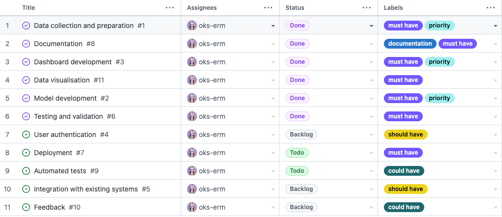

# Powdery Mildew Detector (ML project)

Powdery mildew detection on cherry leaves is a data science and machine learning project with the aim of distinguishing between healthy and diseased cherry leaves. The project includes a binary classification machine learning model that can be used to predict the health status of cherry leaves by uploading images to a Streamlit dashboard. Additionally, the project includes pages with findings from traditional data analysis, a detailed analysis of the hypotheses, and an evaluation of the model's performance.

To ensure a functional pipeline, the project includes three Jupyter notebooks covering data importation and cleaning, data visualization, and development and evaluation of a TensorFlow deep learning model. These notebooks provide a clear and organized way to manage the project's data and development process.

The project's ultimate goal is to improve the accuracy and efficiency of powdery mildew detection on cherry leaves, which can help growers to identify and treat diseased cherry trees more effectively. By utilizing machine learning and data analysis techniques, this project has the potential to provide an effective and user-friendly solution for identifying healthy and diseased cherry leaves.
___
## Dataset Content
* The dataset is sourced from [Kaggle](https://www.kaggle.com/codeinstitute/cherry-leaves), backed with a hypothetical scenario from Code Institute in which predictive analytics could be utilised for a practical project case.

* The dataset contains +4 thousand images taken from the client's crop fields. The images show healthy cherry leaves and cherry leaves that have powdery mildew, a fungal disease that affects many plant species. The cherry plantation crop is one of the finest products in their portfolio, and the company is concerned about supplying the market with a compromised quality product.
___
## Business Requirements
The cherry plantation crop from Farmy & Foods is facing a challenge where their cherry plantations have been presenting powdery mildew. Currently, the process is manual verification if a given cherry tree contains powdery mildew. An employee spends around 30 minutes in each tree, taking a few samples of tree leaves and verifying visually if the leaf tree is healthy or has powdery mildew. If there is powdery mildew, the employee applies a specific compound to kill the fungus. The time spent applying this compound is 1 minute.  The company has thousands of cherry trees, located on multiple farms across the country. As a result, this manual process is not scalable due to the time spent in the manual process inspection.

To save time in this process, the IT team suggested an ML system that detects instantly, using a leaf tree image, if it is healthy or has powdery mildew. A similar manual process is in place for other crops for detecting pests, and if this initiative is successful, there is a realistic chance to replicate this project for all other crops. The dataset is a collection of cherry leaf images provided by Farmy & Foods, taken from their crops.

* 1 - The client is interested in conducting a study to visually differentiate a healthy cherry leaf from one with powdery mildew.
* 2 - The client is interested in predicting if a cherry leaf is healthy or contains powdery mildew.
* 3 - The client wants a dashboard that meets the above requirements.
* 4 - The client requires explanations of possible outcomes

___
## Hypothesis and validation

1. Cherry leaves infected with powdery mildew have unique visual characteristics that can be differentiated from healthy cherry leaves using machine learning algorithms. We expect cherry leaves infected with powdery mildew have white or grayish powdery coating on the surface, typical symptom is white or grayish marks on the leaves.

**Validation**
The model was able to identify the differences between data points and learn how to accurately predict outcomes based on those distinctions. A model has the ability to predict results on new data without becoming too reliant on the training set. By doing so, the model can generalize its predictions and make reliable forecasts for future observations. Rather than simply memorizing the relationships between features and labels in the training data, the model learns to recognize general patterns, which enhances its predictive power. The model v2 is able to do it with accuracy 99%.

2. An ML system trained on cherry leaf images can accurately differentiate between healthy and powdery mildew-infected cherry leaves with at least 90% accuracy. Based on the low complexity of the binary classification task, it is reasonable to expect about 90% accuracy rates.

**Validation**
The hypothesis has been verified by creating a model which has shown excellent performance on the two main evaluation metrics for  assessing the business functionality and achievement of the project, namely the overall F1 score 99% and the recall on the powdery mildew label 99%.
    
3. Implementing image visualisation in the cherry leaf inspection process will result in a reduction of misidentification of infected leaves.

**Validation**
Despite the ML model's high accuracy in predicting, the visual features of the disease are hardly distinguishable during the initial stages. Therefore, to reinforce the model and achieve a higher final accuracy, visual examination of cases where the model is not confident is carried out by a staff member during the ML prediction process. This is accomplished using an image and a prediction plot in the Powdery Mildew Detection tab.

 4. The implementation of the ML solution can improve the accuracy and speed of the cherry leaf inspection process, leading to more efficient use of resources and increased productivity and increased worker safety by reducing the amount of time and exposure required for manual inspection of cherry leaves.

**Validation**
 The business case states: 'An employee spends around 30 minutes in each tree, taking a few samples of tree leaves and verifying visually if the leaf tree is healthy or has powdery mildew. If it has powdery mildew, the employee applies a specific compound to kill the fungus. The time spent applying this compound is 1 minute. This would mean that it would take 50 hours to inspect and treat 100 trees manually. Now, let's assume that taking pictures of the tree leaves using a smartphone camera and uploading them to the ML model for analysis takes approximately 1 minute per tree. This would mean that it would take 1 hour and 40 minutes to take pictures of all 100 trees and upload them for analysis."

The ML model has 99% accuracy in predicting the health of the trees, the staff member could then focus their attention on the trees that the model has identified as having powdery mildew. This would significantly reduce the time and effort required for manual verification, as the staff member would only need to visually verify a subset of trees rather than all of them. Overall, with the implementation of an ML model, the time required for inspecting and treating 100 trees could be reduced from 50 hours to approximately 2 hours, a savings of 48 hours or 96 % reduction in time.

5. The use of the ML predicting can significantly reduce the company's reliance on manual labour for detecting powdery mildew on cherry leaves, resulting in cost savings and increased efficiency.

**Validation**
We will need to measure the reduction in manual labour needed for detecting powdery mildew on cherry leaves after implementing the ML solution. We can compare the time taken and cost incurred in the manual inspection process before and after implementing the ML system. Additionally, we can survey the employees involved in the inspection process to gather their feedback on the effectiveness of the ML system in reducing their workload and increasing their efficiency.

## ML Task Rationale

*Business Requirement 1:*

As a client, I can navigate easily around an interactive dashboard so that I can view and understand the data presented.
As a client, I can view an image montage of either healthy or powdery mildew-affected cherry leaves so that I can visually differentiate them.
As a client, I can view and toggle visual graphs of average images (and average image difference) and image variabilities for both healthy and powdery mildew-affected cherry leaves so that I can observe the difference and understand the visual markers that indicate leaf quality better.

*Business Requirement 2:*

As a client, I can access and use a machine learning model so that I can obtain a class prediction on a cherry leaf image provided.
As a client, I can provide new raw data of a cherry leaf and clean it so that I can run the provided model on it.
As a client, I can feed cleaned data to the dashboard to allow the model to predict on it so that I can instantly discover whether a given cherry leaf is healthy or affected by powdery mildew.
As a client, I can save model predictions in a timestamped CSV file so that I can keep an account of the predictions that have been made.

*Business Requirement 3:*

As a client, I can view an explanation of the project's hypotheses so that I can understand the assumptions behind the machine learning model and its predictions.
As a client, I can view a performance evaluation of the machine learning model so that I can assess its accuracy and effectiveness.
As a client, I can access pages containing the findings from the project's conventional data analysis so that I can gain additional insights into the data and its patterns.

*Business Requirement 4:*

As a client, I can access explanations of possible outcomes from the machine learning model so that I can understand how the model arrived at its predictions and what factors contributed to its decision.

## ML Business Case

* The goal is to develop an ML tool that can efficiently and accurately detect if a cherry leaf is healthy or infected with powdery mildew, thus increasing the efficiency of the inspection process and labour quality.

* The dataset provided by the customer will be used to train the ML tool, and the tool's expected output is the ability to accurately differentiate between healthy and infected leaves.

* The customer requires a user-friendly dashboard that allows for the quick uploading of leaf images and at least 97% accuracy in determining if the leaf is healthy or infected.

* To ensure proprietary data remains secure, appropriate measures will be implemented to protect customer data.

* The success of the ML tool will be measured by its accuracy and efficiency in identifying infected leaves, and its ability to reduce the time and cost associated with manual inspection processes.
* The ML tool can be extended to monitor the effectiveness of powdery mildew treatment programs by identifying whether treated leaves return to a healthy state or not.
* The ML tool has the potential to be extended to other crops, such as those that require pest detection, to improve the efficiency and accuracy of the inspection process.
* Validation of the ML tool's performance will be done by training and validating the ML model on a dataset of cherry leaf images with labelled powdery mildew and healthy leaves, and evaluating its performance using appropriate metrics such as accuracy or F1 score.
* The model success metric are:
        * A study showing how to visually differentiate a cherry leaf that is healthy from one that contains powdery mildew.
        * The capability to predict if a cherry leaf is healthy or contains powdery mildew.
        * The model accuracy on test data is over 90%

___
## Agile Methodology

The development has followed an Agile methodology, using GitHub's projects to prioritize and track user stories and features. The approach enabled the implementation of ideas based on their level of importance, ensuring that the website functionality and user experience were not compromised. The following categories were applied, as well as corresponding labels were created:

* must have
* should have
* would have
* could have

The development followed an AGILE approach, which allowed for the delivery of a functional and feature-rich site. The project was constrained by time limitations, which resulted in some initially listed features not being implemented. However, AGILE methodology is incredibly helpful in situations like this, as it allows for the prioritization and tracking of user stories. Completed user stories are in the "Done" section and the ones that were not prioritised for the first iteration are currently in the "To Do" section to be covered in the next iteration.

[See the current state of the project here.](https://github.com/users/oks-erm/projects/3/views/1)

## CRISP-DM

The CRISP-DM approach is a useful framework for developing data mining and AI projects. It helps to align the project goals with the data collection, preparation, modeling, and understanding phases. In the case of the mildew detection project, the CRISP-DM model was repeatedly used to connect the project's hypothesis and model with the stakeholders' requirements.

[!](readme_assets/crisp.png)

**Business Understanding:** The goal of the project was to develop an AI model that could detect powdery mildew on cherry leaves. The project was meant to help farmers detect the disease early and take action to prevent its spread.

**Data Understanding:** The dataset was provided by Code Institute and consisted of images of cherry leaves with and without powdery mildew. The dataset was labelled and had a total of 4000+ images.

**Data Preparation:** The images were preprocessed and cleaned to remove any noise or irrelevant information. The images were also resized and normalized to ensure consistency across the dataset. The dataset was split into training, validation sets and test sets.

**Modeling:** A convolutional neural network (CNN) was chosen as the appropriate model to match the data and produce the desired outcome. The model was developed using TensorFlow and Keras.

**Evaluation:** The model was evaluated using various metrics such as accuracy, precision, recall, and F1 score. The model was also tested on a separate test set to ensure that it was not overfitting the training data.

**Deployment:** The final model was integrated into a Streamlit dashboard that allowed users to upload an image of a cherry leaf and get a prediction of whether it had powdery mildew or not. The dashboard also displayed visualizations of the dataset and the model's performance.

___
## Dashboard Design

1. ***The Summary*** Page of the project provides essential details about the project's background, including its origin and the customer who initiated it. It also lists the business requirements identified by the customer, which define the project's success criteria. Additionally, the page includes the project's objectives and the processes involved in achieving them.

2. ***The Cherry Leaf Visualizer*** page covers the first Data Analysis business objective of the project. It contains plots that can easily be opened and closed via the inbuilt toolbar. 

This app page also includes an image montage creation tool, where the user can slect a class of label for which to display a montage generated via graphical presentation of random validation set images.

3. ***The Powdery Mildew Detection*** provides a downloadable dataset of infected and uninfected cherry leaf images for live prediction on Kaggle. The user interface includes a file uploader widget that allows the user to upload multiple images of cherry leaves. The system displays the uploaded image, a bar plot of the predicted outcome, and a prediction statement that indicates whether the leaf is infected with powdery mildew and the associated probability. The interface also includes a table that lists the image name and prediction results. Additionally, there is a download button that allows the user to download the report in a .csv format, and a link to the Readme.md file for further information about the project.

4. ***The Hypothesis*** page displays the 5 hypotheses and outcome goals for the project, including success metrics.

5. ***ML Prediction Metrics*** page displays various metrics and visualizations related to the performance of a machine learning model for predicting whether cherry leaves are infected with powdery mildew or not. The first section shows the frequency of labels in the train, validation, and test sets. The second section displays the model training accuracy and losses. The third section shows the general performance of the model on the test set, including the confusion matrix, accuracy, and loss. The fourth section displays the classification report for the model. The final section shows the ROC curve for the model and its AUC score, indicating the model's ability to distinguish between the healthy and powdery mildew classes.

___
## Testing
...
...
...
___
## Unfixed Bugs
...
...
...
___
## Deployment
### Heroku

* The App live link is: 
* The project was deployed to Heroku using the following steps.

1. Log in to Heroku and create an App with desired name
2. Log into Heroku CLI in IDE workspace terminal using the bash command: *heroku login -i* and enter user credentials
3. Run the command *git init* to re-initialise the Git repository
4. Run the command *heroku git:remote -a "YOUR_APP_NAME"* to connect the workspace and your previously created Heroku app.
5. Set the app's stack to heroku-20 using the bash command: *heroku stack:set heroku-20* for compatibility with the Python 3.8.12 version used for this project
6. Deploy the application to Heroku using the following bash command: *git push heroku main*

### Forking the GitHub Project
To make a copy of the GitHub repository to use on your own account, one can fork the repository by doing as follows:

* On the page for the [repository](https://github.com/oks-erm/ML-mildew-detection), go to the 'Fork' button on the top right of the page, and click it to create a copy of the repository which should then be on your own GitHub account.

### Making a Local Clone

* On the page for the [repository](https://github.com/oks-erm/ML-mildew-detection), click the 'Code' button
* To clone the repository using HTTPS, copy the HTTPS URL provided there
* Open your CLI application of choice and change the current working directory to the location where you want the cloned directory to be made.
* Type git clone, and then paste the previously copied URL to create the clone

___
## Main Data Analysis and Machine Learning Libraries
- [NumPy](https://numpy.org/) - Processing of images via conversion to NumPy arrays. Many other libraries used in this project are also dependent on NumPy
- [Pandas](https://pandas.pydata.org/) - Conversion of numerical data into DataFrames to facilitate functional operations
- [Matplotlib](https://matplotlib.org/) - Reading, processing, and displaying image data, producing graphs of tabular data
- [Seaborn](https://seaborn.pydata.org/) - Data visualisation and presentation, such as the confusion matrix heatmap and image dimensions scatter plot.
- [Plotly](https://plotly.com/python/) - Graphical visualisation of data, used in particular on dashboard for interactive charts
- [TensorFlow](https://www.tensorflow.org/versions/r2.6/api_docs/python/tf) - Machine learning library used to build model
- [Keras Tuner](https://keras.io/keras_tuner/) - Tuning of hyperparameters to find best combination for model accuracy
- [Scikit-learn](https://scikit-learn.org/) - Calculating class weights to handle target imbalance and generating classification report
- [Scikit-image](https://scikit-image.org/) - Application of Sobel filters to image averages to detect edges and dominant features

## Other technologies used
- [Streamlit](https://streamlit.io/) - Development of dashboard for presentation of data and project delivery
- [Heroku](https://www.heroku.com/) - Deployment of dashboard as web application
- [Git/GitHub](https://github.com/) - Version control and storage of source code
- [Gitpod](https://www.gitpod.io/) - IDE Workspace in which application was developed

## Credits 

* In this section, you need to reference where you got your content, media and from where you got extra help. It is common practice to use code from other repositories and tutorials. However, it is necessary to be very specific about these sources to avoid plagiarism. 
* You can break the credits section up into Content and Media, depending on what you have included in your project. 

### Content 

- The text for the Home page was taken from Wikipedia Article A.
- Instructions on how to implement form validation on the Sign-Up page were taken from [Specific YouTube Tutorial](https://www.youtube.com/).
- The icons in the footer were taken from [Font Awesome](https://fontawesome.com/).

### Media

- The photos used on the home and sign-up page are from This Open-Source site.
- The images used for the gallery page were taken from this other open-source site.
____

## Acknowledgements (optional)
* Thank the people that provided support throughout this project.
